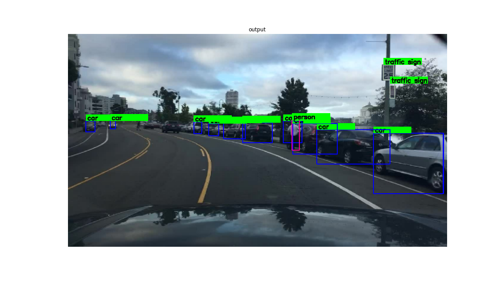
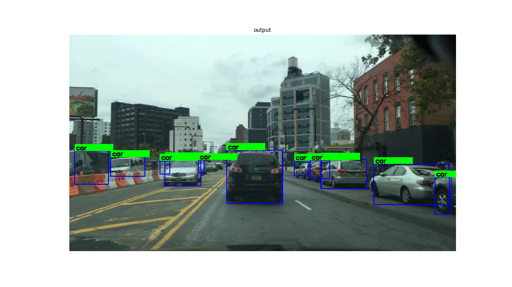
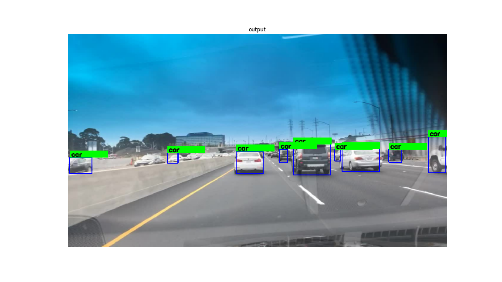
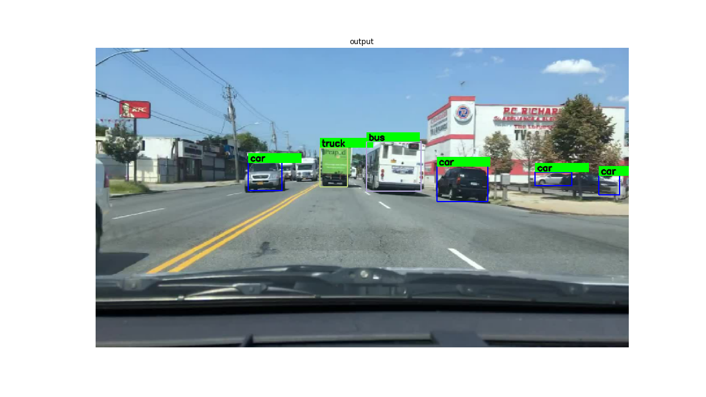
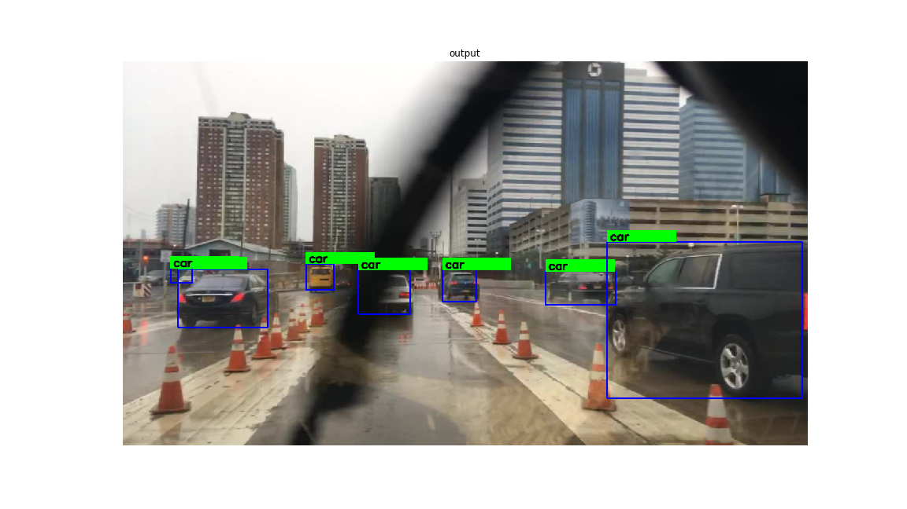

# YOLOv1-TensorFlow2.0
This is a TensorFlow2.0 implementation of the YOLOv1 paper https://arxiv.org/abs/1506.02640, with the 
following changes,
 - The feature exactor resembles the one mentioned in the YOLO9000 paper
 - Input size is changed from 448x448 to 608x608
 - The output stride is reduced from 64 to 32, to capture smaller objects
 - Used 9 boxes per grid location, the paper uses 2. [doing this did not help much]
 
## Video results
  

 

## Weights
[trained weights](https://drive.google.com/file/d/1JDrBWXvNXUuuvxWvJPIMsomqXMshnhpa/view?usp=sharing)

## TODO
- [x] Change backbone to the one from YOLO9000
- [x] Use tf.distribute.MirroredStrategy for multi gpu training
- [x] Use tf.data.Dataset to implement the data input pipeline
- [ ] Add quantitative results 
- [ ] Use learning_rate schedule during training
- [ ] Add horizonal flip in data input pipeline

## Outputs

 

## Training
 - The model was trained on the Berkeley Deep Drive (BDD) dataset, which has 70,000 training images and 
10000 validation images
 - The model was trained for 200 epochs with a learning_rate of 5e-4 and a batch size of 24 [8 images 
per gpu] with heavy augmentations [brightness, saturation, contrast]
 - No learning_rate schedule was followed (but was used by the authors).
